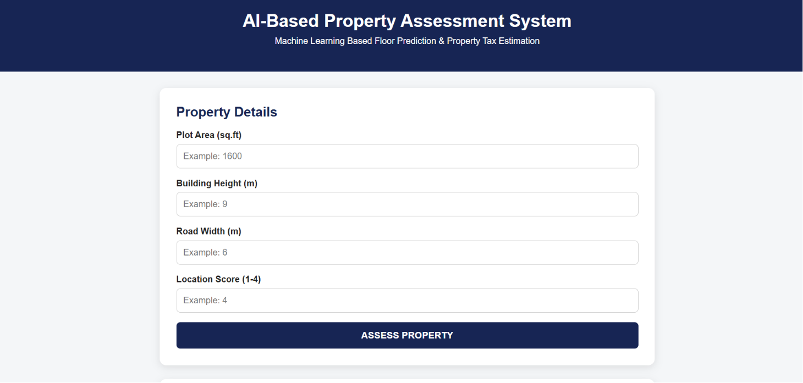
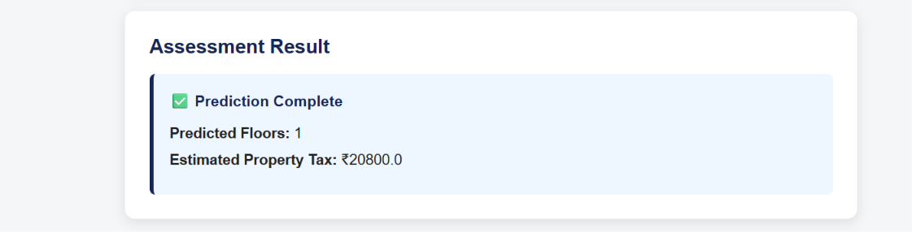

# AI-Based Floor Prediction and Tax Assessment System

## 🌐 Live Demo

[Open the Live Application](https://ai-based-floor-prediction-tax-assessment.onrender.com)

## 📸 Screenshots

### Home Page



### Assessment Result


## 📌 Project Overview

The AI-Based Floor Prediction and Tax Assessment System is a Python-based machine learning application designed to predict the authorized number of floors for a building and estimate its property tax.

The system analyzes property and structural information such as plot area, building height, road width, and location score. A Machine Learning model is used to predict the number of floors, while a tax calculation module estimates the property tax.

A graphical user interface (GUI) is developed using Tkinter to make the system simple and easy to use.

## 🎯 Objectives

- Predict the number of authorized building floors.
- Estimate property tax based on property details.
- Automate the property assessment process.
- Reduce manual calculation and assessment work.
- Provide a simple graphical interface for users.
- Store assessment history using SQLite.

## 🛠️ Technologies Used

- Python
- Machine Learning
- Scikit-learn
- Pandas
- NumPy
- Tkinter
- SQLite
- Joblib

## 🤖 Machine Learning

The project uses a Random Forest Classification model to predict the number of floors.

### Input Features

- Plot Area
- Building Height
- Road Width
- Location Score

### Output

- Predicted Number of Floors

## 💰 Property Tax Assessment

After predicting the number of floors, the system estimates the property tax using the property and assessment parameters.

The final result displays:

- Predicted Floors
- Estimated Property Tax

## 🖥️ Application Features

- User-friendly Tkinter interface
- Property assessment form
- Machine learning-based floor prediction
- Automatic tax estimation
- Assessment history
- SQLite database integration
- Input validation
- Clear result display

## 📂 Project Structure

```text
AI-Based-Floor-Prediction-Tax-Assessment/
│
├── app/
│   ├── check_data.py
│   ├── database.py
│   ├── generate_dataset.py
│   ├── gui.py
│   ├── init_database.py
│   ├── main.py
│   ├── predict_floor.py
│   ├── tax_calculation.py
│   └── train_model.py
│
├── dataset/
│   └── property_data.csv
│
├── documentation/
│   ├── Major_Project_Report.docx
│   └── PROJECT_DOCUMENTATION.txt
│
├── model/
│   └── floor_prediction_model.pkl
│
├── .gitignore
├── README.md
└── requirements.txt
